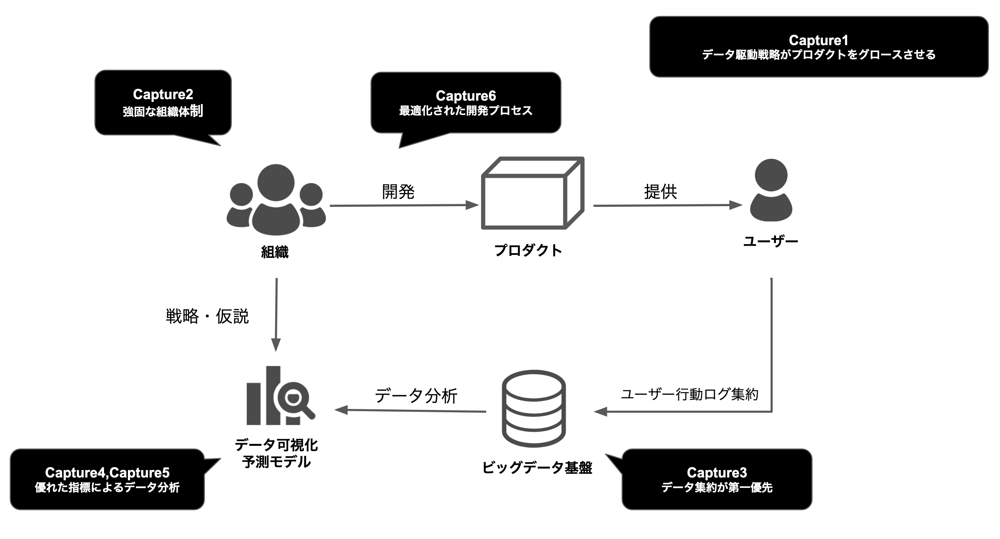

### 本書の構成

本書の構成についても説明していきます。

Capture1では「データ駆動戦略」とは何者かを明確にしていきます。どんなフェーズで「データ駆動戦略」の考え方が必要になってきて、何が実現可能になるのか。そして、どのようなプロセスを踏めば実現可能なのかを後続のCaptureに譲る形で述べていきます。 

Capture2では、「データ駆動戦略」を実現するために必要な強固な組織体制について合同会社DMM.comを題材として組織構造や組織文化、カルチャーを通して「データ駆動戦略」に適した組織設計とは何かを述べていきます。 

Capture3からは、本格的に「データ駆動戦略」を実現するための方法論に入ってきます。 
まずは、データを集約することが第一優先事項として、ビックデータ基盤、データ分析基盤の重要性について説いていきます。
データ分析基盤の使いやすさこそがデータ駆動戦略を組織文化として浸透させるとても大事な点になります。 

Capture4では、ビックデータ基盤にある膨大なデータから、どのようにビジネス価値があるデータを見つけるかを「優れた指標」として紹介します。
「優れた指標」をもとに分析されたデータでないと「駆動」しないためです。 

Capture5では、Capture4で学んだ指標をもとにどのようにデータを可視化して行けばよいかを述べていきます。
KPIマネジメントを代表として現状理解のアプローチをベースに仮説検証型アプローチ、探索的データ分析といったデータ分析の手法を述べていきます。 

Capture6では、データ駆動を加速させるために必要な開発プロセスの話をしていきます。 
いわゆるCapture1~5で述べてきたことを実際の開発に乗せたときにどういったプロセスを設計するべきかです。特にCapture5で述べるデータ分析によってプロダクトをグロースさせるために必要な「データ」が見えてきます。 
その「データ」を高速に変化をもたらしKPIの数値を変動させるためには、最適化された開発プロセスで仮説検証をAgility高く加速させる必要があります。 

以下の本書の構成における図解を記載します。
<figure>
    
</figure>
 
