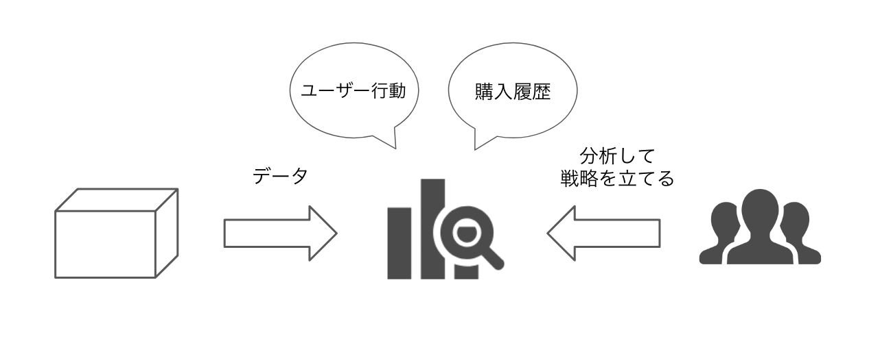

### データ駆動戦略がプロダクトをグロースさせる
  「データ駆動戦略」なるものは、私たちが日々奮闘しているプロダクト開発にどうような影響を与えてくれるのかを明らかにしていきましょう。

  プロダクト開発にはさまざまなフェーズがありますが、その多くはプロダクトのローンチを終えるとプロダクトをグロースさせることに奮闘します。
  新しいサービスを世に送り出した喜びもつかの間、次は利益やプロダクトがもたらす効果を考えていかなければいけません。

  多くのエンジニアは、新しいプロダクトを開発することに喜びを覚えることが多く、いわゆる「運用」というフェーズというものに興味が希薄気味になります。
  新しい技術を使って、新しいプロダクトを開発したい。要は「0→1」を作り上げることにモチベーションがあがります。
  しかし「プロダクトを育てていく」というフェーズは、とても奥が深く重要なものです。
  実際には、この「運用」という名の「グロースフェーズ」に、とてもエンジニア組織が力が必要となってくるのです。

  多くの企業では、サービスがローンチするまでは開発チームが開発をして0→1を作り上げる。そのあとは企画やマーケティング担当者が、広告費をかけて宣伝を行ったり、サービスの利用者を増やすために営業をかけたり、エンジニアがグロースという観点でアクションを起こすのはそこまで多くありませんでした。既存システムの保守がメインで企画やマーケティング担当者からお願いされた、施策を実施するためにシステムに改修を加えるといったことがメインの作業になることが多いです。

  「データ駆動戦略」は、いわゆるプロダクトをグロースさせるフェーズに力を発揮します。

  そして「データ駆動戦略」の考え方は、このプロダクトをグロースさせるフェーズに特に力を発揮します。

  たとえ、リリースした機能がユーザーに受け入れられなかったら「どうして受け入れられなかったのか」「改善点はないか」などを組織・チームとして考えていく必要があります。そのときの武器として「データ」というのものは我々の手助けをしてくれます。
  「データ」をうまく活用し分析すれば、プロダクトの改善点はもちろんプロダクトの未来を予測できると考えています。
  さらに「データ」という武器を手にするだけではなく、組織として「データ」を活用する文化を作らなければ「データ駆動」な戦略は立てられません。

  詰まる所「データ駆動戦略」とは、「データ」が駆動し合うことで見えてくる、プロダクトの様々の情報をもとに未来を予測したり、意思決定したりすることでプロダクトをより成長させることです。
  そのためには、組織の意思決定の中に「データ」を大きな要素としてインプットしていく必要がありますが、そもそも「データ」を見る力を組織全員が持っていないといけません。そういった意味で「データ」という武器を持っているだけではなく、組織として「データ」という数値をどう追っていくかまで考えていかなければいけません。
あ
  <figure>
      
      
図1.1 データ駆動戦略のイメージ

  </figure>
   

  このCapture1は、「データ駆動戦略」についての大枠を説明していきます。
  なぜ組織にデータ駆動戦略が必要なのか、何ができるのか。そして、どうやったら実現できるかを述べていきます。
 
 
