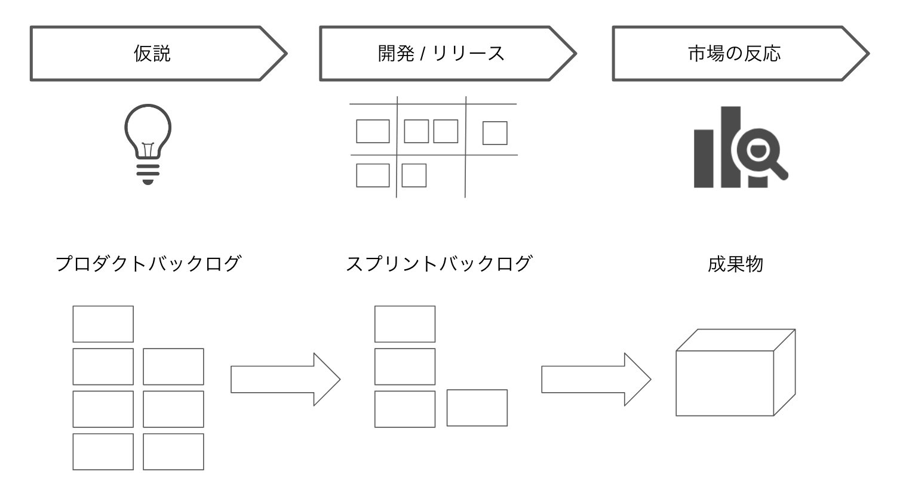
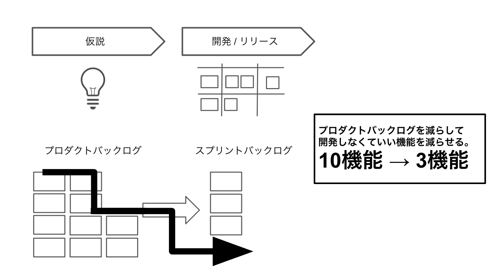
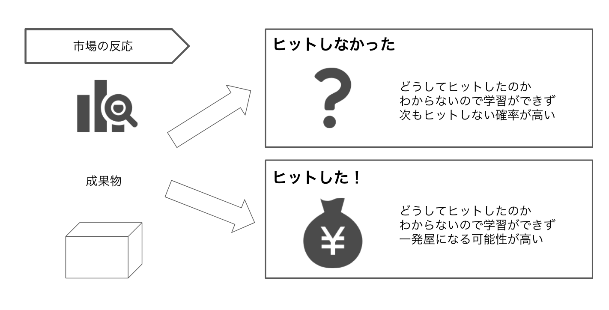
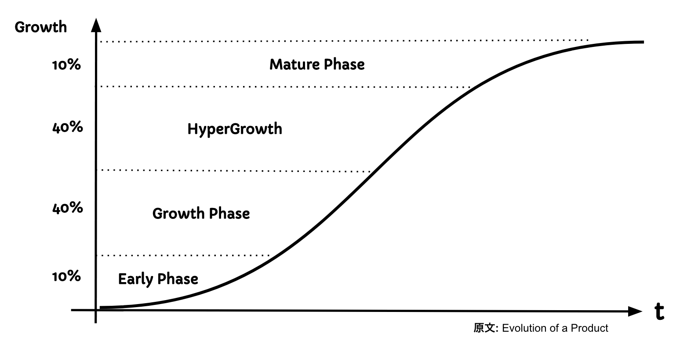
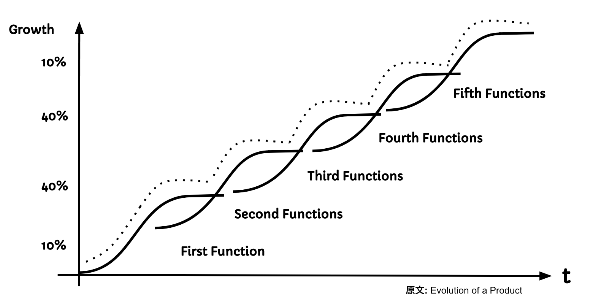

#### なぜ、データ駆動戦略が必要なのか
  そもそも、データ駆動でないプロダクト開発とはどんな状態でしょうか？
  「データ」というものを重要視しないプロダクト開発のイメージを見ていきましょう。図1.2をご覧ください。

  <figure>
      
      
図1.2 開発プロセスの例

  </figure>
 

図1.1は、標準的な開発プロセスだと思っています。例としてスクラム開発を取り入れているとします。

1. 仮説を立案します。それがストーリーベースでプロダクトバックログに積まれていきプロダクトとして開発するリストとなります。
2. 次に開発/リリースのフェーズへ移ります。プロダクトバックログから優先順位が付けられ高いものから、開発者が開発しやすいタスクまで分解されたものがスプリントバックログへと落とし込まれ開発していきます。
3. 最後にリリースされたものが市場へと投入されます。そして、また新しい機能の開発へと移ります。

データを活用していないことを前提にこの開発プロセスには2つの問題点があります。
- 仮説の妥当性
- リリース後の検証

ひとつずつ述べていきます。

##### 直感に頼る仮説立案の危険性
仮説を立てるときにどのようなことを考えて立案するでしょうか。
直感や感覚に頼って仮説立案をしている方が多いのではないでしょうか。
このビジネスモデルのプロダクトにはこういった機能が必ず必要だと知らず知らずに思い込んでないでしょうか？ また、機能を詰め込んではいないでしょうか？

<!--
UIがごちゃごちゃしているサイトの図を乗せる
Adobeで作る
-->

よくあるのがUI/UXの観点が抜けていると沢山の機能を入れればユーザーが喜ぶはずだという考えていることです。あれもこれもと機能を詰め込み、プロダクトの全体を見ると機能は充実しているけど、とてもUI的に使いづらいといった現状が起きてユーザーが離れるといったことが起きがちです。

また、こういった直感に頼る仮説立案は、「量産されやすい」という特性を持っています。
プロダクトオーナーをはじめとするプロダクト責任者は、あるプロダクトに対して機能をどんどん直感で思いつき、要求定義を作成して、「これを開発してくれ！」と開発者へ下ろしていきます。

では、量産することでどういった問題点があるのでしょうか。一番は、開発者の負荷が上がることです。
つまり、直感に頼る仮説は「仮説の妥当性」というものが担保できていないので機能をリリースした後のヒット率が低いと考えています。
そのため結果的に、3機能を開発してリリースすれば良かったものを10機能作ってしまったというケースが出てきます。

<figure>
    
    
図1.3 仮説の妥当性によるプロダクトバックログの削減

</figure>
 

「仮説の妥当性」というのは、リリースした機能がすべて100％ヒットする機能を担保するのではなく、少しでもヒット率をあげるという意味合いが大事です。
また、妥当性を担保することで開発者もそれに納得して開発ができることもとても重要です。

逆にそういった素晴らしいアイデアマンがこの世界のどこかにいたとしましょう。
ただし、私を含めてほとんどの人は、**普通のエンジニアだということを忘れてはいけません。**
そういった素晴らしいアイデアマンに太刀打ちするには、何か武器が必要です。それが「データ駆動」です。

##### リリース後の効果検証の重要性
また、もう1つの問題点として、機能をリリースしてから学習していないところです。
これは、リリースした機能がヒットしてもそうではなくとも問題です。

図1.3で示すように、ヒットしなかった場合にはどうしてヒットしなかったのか学習しないと再度機能を追加しても再びヒットする確率は低いでしょう。
また、ヒットしたとしてもどうしてヒットしたのかを理解しないと一発屋になっていまします。

<figure>
    
    
図1.4 リリース後の効果検証の重要性

</figure>
 

##### プロダクトの成長過程
ここで世界的なベンチャーキャピタル（VC）である、Sequoia Capitalの「Evolution of a Product」からプロダクトの成長過程についてご紹介します。図1.4をご覧ください。

Sequoia Capitalによるとプロダクトの成長段階としては、4段階あると述べています。
図1.3にあるように「S字カーブ」描きながら上昇して行くことが理想とされています。

<!-- TODO ここは引用なのであとで書き直す-->
<figure>
    
    
図1.5 プロダクトの成長過程

</figure>
 

###### Early Phase
はじめにEarly Phaseです。人々がそれを皆さんの予想どおりに使うかどうかを知るのは困難です。最初の目標は、製品のことを愛してくれると仮定した数千人にその製品を採用してもらうことです。ただ好きなだけのユーザーが大勢いるよりも、愛してくれるユーザーを少し獲得するほうが好都合です。立ち上げからおよそ1カ月間は大勢のユーザーが真新しさからそのプロダクトを試してくれるでしょう。それを気に入ってアーリーアダプターとなる人もいますが、一方で去っていく人も出てきます。
初期段階では、離脱が復帰をはるかに上回り、新規ユーザーのMAUに対して重大な影響を与えます。継続ユーザー曲線の平坦化が意味するのは、そのプロダクトの離脱と復帰の間でバランスを取っているということです。

###### Growth Phase
初期段階の終わりまでに、その製品は日常的に使い始めている数万人によって採用されているかもしれません。しかし、これは必ずしも製品が市場に適合していることを意味しません。次にその製品を採用する数十万人のユーザーは誰か、そしてその人々に応じるためにはどんな変更を加えるべきかについて考えることが重要です。
アクティブな継続ユーザーが増加するにつれて、新規ユーザーのMAUに占める割合は小さくなります。ゆっくりと、しかし確実に、その製品の市場浸透が増え始めます。古参の集団内では復帰と離脱の間でバランスが取れているため、定着率が安定しますが、新参の集団内では離脱が復帰をはるかに上回り続けます。古参の集団がユーザー全体でより大きな割合を占めているため、復帰数全体は離脱数に対して (復帰数の方がまだ少ないものの) 伸びていき、MAUに対して重大な影響を与え始めます。この段階中、アクティブユーザー全体にとって圧倒的に重要なのは継続ユーザーです。

###### HyperGrowth Phase
これまで開発されてきた最高レベルの製品の多く (例えばFacebook、Instagram、WhatsApp、Amazon、Netflix、Uber、Evernote) にはある一つの共通点があります。すなわち、「超成長」段階です。この段階中、新参の集団について、同じ時間枠のこれまでの集団のものと比較すると、1か月 (M1) の定着率水準が上昇し始めています。したがって、復帰の離脱に対する比率が改善します。これは通常、次に挙げるどちらかのタイミングで始まります。1) 実現可能な最大の市場規模に対し、一定レベルの普及率に到達したとき。 2) その製品がかなり有名になったとき。それに加えて、この段階中に古参集団の復帰数がより巨大になり始め、離脱数が減り始めます。図4で示されるとおり、新参と古参、全てのユーザーがその製品に価値を見いだします。

###### Mature Phase
盛大な超成長段階を終えると、その製品は成熟段階に突入します。その間、実現可能な市場規模に対する普及率が高いレベルに到達します。また、新たに加わる残りユーザーもわずかとなります。この段階では、製品はもはや成長していきません。古参と新参など、あらゆる集団で復帰と離脱の安定したバランスに到達しています。そして、集団レベルでは継続ユーザーの合計数がアクティブユーザーの総数と等しくなっています。この段階では、継続ユーザーの総数がアクティブユーザーの総数に占める割合も大きくなっています。また、復帰数と離脱数がアクティブユーザーに占める割合も小さくなります。

そして、このMature Phaseにプロダクトの状態が入るとプロダクトや機能を増やさなければプロダクトや企業価値が下がっていきます。
そのため、理想のプロダクトとしては図1.5のように「S字カーブ」が連続して続いている状態が良いとされています。
リリースした機能(Functions)同士が、S字カーブを重複させて成長の右肩上がりになっていくのです。
つまり、何を指しているかを考えると前の機能から何らかの「学習」をしています。

<figure>
    
    
図1.6 機能が重なり合ってプロダクトはグロースする

</figure>
 

では、こういった理想のプロダクト成長曲線を描くためにはどうすればよいでしょうか？
１つの解として、「データ駆動」という考え方です。
つまり、データが駆動して、機能、プロダクトリリースから見えた様々なデータを次の機能、プロダクトに活かされてプロダクトを成長させていきます。
詳しいデータの見方、分析方法については、Capture5で詳しくご紹介しますが、リリース後のプロダクトは様々なデータを見せてくれます。
どんなユーザー属性の方が機能を利用したか、いつコンテンツを利用・購入したか、クリックしたかなどユーザーの行動がビッグデータ基盤に集まってきます。
そのデータを様々な指標の観点で見ることによって傾向を探ることができ、未来を予測できるようになります。

<!--
TODO : 事例入れても良いかも : 検索プロダクト、レコメンド、etc...
-->

##### 学習しつづける組織にも「データ駆動」が必要
「データ駆動」の考え方は、プロダクトのグロースだけでなく、組織レベルをグロースさせます。
日々、変化しつづける環境の中で「強い組織」というのは、自ら学習し続けられる組織です。

特にプロダクトに関する変化については、組織としてどう変化を受け取り、次につなげられるかが学習し続ける組織にとって重要となってきます。
施策を実行し、その結果をどうだったのか、次はどんな行動をすれば良いのかを共通認識にすることこそ、学習し続けられる組織になるための大きな要素だと考えられます。

<!--
図 :
学習しつづける組織と変化しつづける環境の図。それを様々なデータが駆動するようなサイクルを回すことで組織が強くなる図

ダブルループの図？
-->

###### Learn vs Unlearn
では、学習し続ける組織における「学習」のサイクルについて考えていきましょう。
詳しくはCapture2で紹介しますが、組織の学習過程の中で「Unlearn」という考え方があります。
通常の学習を「Learn」に「Un」がついているので「学習棄却」や「脱学習」などの意味に捉えがちですが、日本語としては「学びほぐし」といった言葉が主流になりかけています。

行動に対して結果を返してくれるのが通常の学習(Learn)ですが、...

<!--
unlearnの図
引用部分とかは広木さんのやつから取ってくる
SECIモデルの概要まで述べる。
あとはCapture2に譲る
-->
